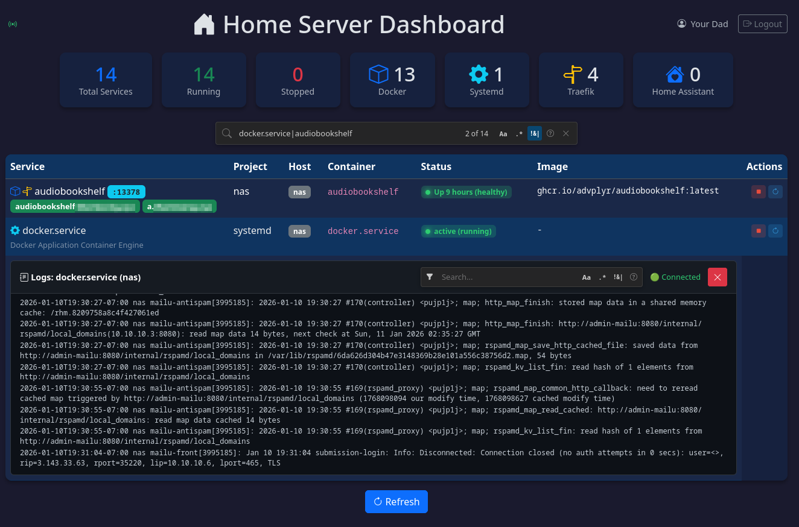

# Home Server Dashboard

A lightweight Go web dashboard for monitoring Docker Compose services and systemd services across multiple hosts.



## Features

- Monitor Docker containers from Compose projects
- Monitor systemd units on local and remote hosts
- Monitor Home Assistant instances (with full HAOS addon support)
- Real-time log streaming via Server-Sent Events
- Real-time service state updates via WebSocket
- Dark theme web interface with sorting, filtering, and search
- Filter mode (hide non-matching) and Find mode (navigate between matches)
- Bang & Pipe query language for advanced filtering - [readme on that](docs/bangandpipe-query-language.md)
- Traefik integration for hostnames and external service discovery
- Log truncation for Docker containers
- Gotify push notifications for service state changes

## Requirements

- Go 1.21 or later
- Docker (for container monitoring)
- SSH access to remote hosts (for remote systemd monitoring)
- Traefik with API enabled (optional, for hostname discovery)
- Home Assistant with long-lived access token (optional, for HA monitoring)

## Quick Start

1. Copy the sample configuration and edit it for your environment:

```bash
cp sample.services.json services.json
```

2. Edit `services.json` to define your hosts and services:

```json
{
  "port": 9001,
  "hosts": [
    {
      "name": "myserver",
      "address": "localhost",
      "systemd_services": [
        "docker.service",
        "nginx.service",
        "myuser:myapp.service"
      ],
      "docker_compose_roots": ["/path/to/your/compose/projects/"]
    }
  ]
}
```

| Field | Description |
|-------|-------------|
| `port` | HTTP server port (default: 9001) |

3. Build and run:

```bash
# Install npm dependencies and build frontend (required once)
npm install
npm run build

# Then build and run Go binary
go build -o nas-dashboard && ./nas-dashboard
```

Alternatively, use `go generate` to run both npm commands automatically:

```bash
go generate ./...
go build -o nas-dashboard && ./nas-dashboard
```

4. Open http://localhost:9001 in your browser.

## Installation

Install as a systemd service:

```bash
./install.sh [username]
```

The install script:
- Compiles and installs binary to `/usr/local/bin/nas-dashboard`
- Copies `services.json` (or `sample.services.json`) to `/etc/nas_dashboard/services.json`
- **Auto-updates config**: If your local `services.json` is newer than the installed version, it will be copied automatically
- Installs and enables the systemd service
- Generates polkit rules for local systemd service control
- `username` defaults to the current user

The script uses `sudo` internally only for commands that require it, so you don't need to run it with `sudo`. This however does mean you need sudoers access ;)

Uninstall:

```bash
./uninstall.sh
```

## How It Works

The dashboard queries Docker containers via the Docker socket, systemd units via D-Bus (for localhost) or SSH (for remote hosts), and Home Assistant instances via the REST API. For HAOS installations, it additionally tunnels through SSH to access the Supervisor API for addon management. It serves a single-page web interface that fetches service status from `/api/services` and displays them in a sortable table. Clicking a service row opens an inline log viewer that streams logs in real-time using Server-Sent Events. The configuration file defines which hosts to monitor and which systemd units to track on each host. Docker Compose projects are auto-discovered by scanning the specified root directories.

## Configuration

Set `address` to `localhost` to use D-Bus for systemd queries. Any other address will use SSH with your default SSH key.

### Traefik Integration

To display Traefik-exposed hostnames as clickable links next to services, enable Traefik in your host configuration:

```json
{
  "hosts": [
    {
      "name": "myserver",
      "address": "localhost",
      "traefik": {
        "enabled": true,
        "api_port": 8080
      }
    }
  ]
}
```

The dashboard queries Traefik's `/api/http/routers` and `/api/http/services` endpoints to discover hostnames and external services:

**Hostname Discovery:** Services with `Host()` or `HostRegexp()` rules get green hostname badges. When both are present, exact `Host()` matches are preferred.

**External Service Discovery:** Traefik can expose services that aren't Docker containers or systemd units (e.g., reverse-proxied external hosts defined in file providers). These appear as "traefik" source services with health status based on Traefik's backend server status (UP/DOWN).

**SSH Tunneling:** For remote hosts, the dashboard automatically tunnels through SSH to reach the Traefik API.

### Home Assistant Integration

The dashboard can monitor Home Assistant instances and display their health status. There are two levels of integration:

1. **Basic monitoring** (any HA installation): Shows HA health status and allows restart
2. **Full HAOS integration** (Home Assistant OS only): Shows all addons, streams logs, and allows addon control

#### Basic Home Assistant Monitoring (Docker/Supervised/Core)

For any Home Assistant installation, you can monitor the core HA service:

```json
{
  "hosts": [
    {
      "name": "homeassistant",
      "address": "192.168.1.50",
      "homeassistant": {
        "port": 8123,
        "use_https": true,
        "ignore_https_errors": true,
        "longlivedtoken": "your-long-lived-access-token"
      },
      "systemd_services": [],
      "docker_compose_roots": []
    }
  ]
}
```

| Field | Description |
|-------|-------------|
| `port` | Home Assistant API port (default: 8123) |
| `use_https` | Use HTTPS for API connection |
| `ignore_https_errors` | Skip TLS certificate verification (for self-signed certs) |
| `longlivedtoken` | Long-lived access token from HA (create in Profile → Security → Long-Lived Access Tokens) |

**Features with basic monitoring:**
- Health status (running/stopped) displayed in dashboard
- Restart HA Core via the dashboard (start/stop not supported without HAOS)
- Gotify notifications when HA becomes unreachable

#### Full Home Assistant OS Integration (HAOS)

For Home Assistant OS installations, you can get complete visibility including all addons, log streaming, and addon control. This requires the [Advanced SSH & Web Terminal addon](https://github.com/hassio-addons/addon-ssh).

**Prerequisites:**

1. Install the **Advanced SSH & Web Terminal** addon from the Home Assistant Add-on Store (Community Add-ons repository)

2. Configure the SSH addon with atleast these options: 
   ```yaml
   ssh:
     username: hassio
     authorized_keys:
       - >-
          (your public key instead, but the whole line just like an authorized_keys file, one per yaml element)
     allow_remote_port_forwarding: true
     allow_tcp_forwarding: true
   ```

3. Start the SSH addon and verify you can connect:
   ```bash
   ssh hassio@192.168.1.50 -p 22
   ```

4. Configure the dashboard with HAOS settings:

```json
{
  "hosts": [
    {
      "name": "homeassistant",
      "address": "192.168.1.50",
      "homeassistant": {
        "port": 8123,
        "use_https": true,
        "ignore_https_errors": true,
        "longlivedtoken": "your-long-lived-access-token",
        "is_homeassistant_operatingsystem": true,
        "ssh_addon_port": 22
      },
      "systemd_services": [],
      "docker_compose_roots": []
    }
  ]
}
```

| Additional Field | Description |
|-----------------|-------------|
| `is_homeassistant_operatingsystem` | Enable HAOS addon discovery via Supervisor API |
| `ssh_addon_port` | SSH addon port (default: 22) |

**How it works:**

The dashboard connects to the SSH addon and creates a tunnel to the internal Supervisor API (`http://supervisor`). It automatically retrieves the `SUPERVISOR_TOKEN` from the SSH addon container, which rotates on each HAOS reboot.

**Features with HAOS integration:**
- All installed addons displayed as separate services
- Real-time log streaming for Core, Supervisor, Host, and individual addons
- Start/stop/restart HA Core via the Supervisor API
- Start/stop/restart addons via the dashboard
- Supervisor and Host OS status display
- Gotify notifications for addon state changes

**Note:** The SSH addon must remain running for the Supervisor API access to work. If you stop the SSH addon, the dashboard will fall back to basic monitoring.

### Gotify Push Notifications

The dashboard can send push notifications via [Gotify](https://gotify.net/) when services change state or hosts become unreachable. This is useful for getting alerted when a service goes down.

```json
{
  "gotify": {
    "enabled": true,
    "hostname": "https://gotify.example.com",
    "token": "your-app-token"
  }
}
```

| Field | Description |
|-------|-------------|
| `enabled` | Enable or disable Gotify notifications |
| `hostname` | URL of your Gotify server |
| `token` | Application token from Gotify (create an app in Gotify's web UI) |

**Events that trigger notifications:**

| Event | Priority | Description |
|-------|----------|-------------|
| Service started | Normal (5) | 🟢 Service went from stopped to running |
| Service stopped | High (8) | 🔴 Service went from running to stopped |
| Host unreachable | Max (10) | 🚨 Cannot connect to a configured host |
| Host recovered | High (8) | ✅ Previously unreachable host is now reachable |

The monitor uses native event sources for efficient real-time detection:
- **Docker**: Uses the Docker Events API to receive container state changes instantly
- **Local systemd**: Uses D-Bus signals for immediate unit state notifications
- **Remote systemd**: Falls back to polling (every 60 seconds) since native events aren't available over SSH
- **Home Assistant**: Polls the HA API at regular intervals; for HAOS, also monitors addon states

**Note:** On startup, the monitor captures the current state of all services without sending notifications, so you won't receive a flood of alerts when the dashboard restarts.

### Docker Labels

The dashboard reads custom labels from Docker containers to customize visibility and display:

| Label | Description |
|-------|-------------|
| `home.server.dashboard.description` | Custom description displayed below service name |
| `home.server.dashboard.hidden` | Set to `true` to hide service from dashboard |
| `home.server.dashboard.ports.hidden` | Comma-separated port numbers to hide (e.g., `8080,9000`) |
| `home.server.dashboard.ports.<port>.label` | Custom label for a specific port |
| `home.server.dashboard.ports.<port>.hidden` | Set to `true` to hide a specific port |
| `home.server.dashboard.remapport.<port>` | Remap a port to another service (for containers sharing network namespace) |

**Port Remapping:** For containers that share a network namespace (e.g., services running through a VPN container like gluetun), use `remapport` to show the port on the correct service:

```yaml
services:
  gluetun:
    image: qmcgaw/gluetun
    ports:
      - "8193:8193"  # qbittorrent web UI exposed through VPN
    labels:
      home.server.dashboard.remapport.8193: qbittorrent
  
  qbittorrent:
    network_mode: "service:gluetun"
    # Port 8193 will appear on qbittorrent with a link using gluetun's IP
```

Example:
```yaml
services:
  myapp:
    labels:
      home.server.dashboard.description: "My application"
      home.server.dashboard.ports.8080.label: "Admin Panel"
      home.server.dashboard.ports.9000.hidden: "true"
```
### Watchtower Integration

The dashboard integrates with [Watchtower](https://containrrr.dev/watchtower/) to suppress false-positive "service stopped" notifications during container updates. When Watchtower updates a container, it briefly stops the old container before starting the new one. Without integration, this would trigger unwanted "service down" alerts.

```json
{
  "hosts": [
    {
      "name": "myserver",
      "address": "localhost",
      "watchtower": {
        "port": 8080,
        "token": "your-watchtower-api-token",
        "update_timeout": 120
      }
    }
  ]
}
```

| Field | Description |
|-------|-------------|
| `port` | Watchtower metrics API port (default: 8080) |
| `token` | Metrics API token for authentication (can use `WATCHTOWER_TOKEN` env var) |
| `update_timeout` | Seconds to wait for container recovery before sending notification (default: 120) |

**How it works:**

1. When a Docker container stops on a host with Watchtower configured, the notification is **queued** instead of being sent immediately
2. The dashboard queries Watchtower's `/v1/metrics` endpoint to check if containers are being scanned or were recently updated
3. If an update is detected as in-progress or recent (within 30 seconds), the container stop is assumed to be update-related
4. The dashboard waits for the container to restart within `update_timeout` seconds
5. **If the container restarts within the timeout**, the notification is cancelled (no alert sent)
6. **If the timeout expires and the container is still down**, the notification is sent normally

**Requirements:**

- Watchtower must have `--http-api-metrics` enabled (for metrics endpoint)
- Watchtower must have `--http-api-token` set (for authentication)
- The dashboard needs network access to Watchtower's metrics endpoint

**Example Watchtower configuration:**

```yaml
services:
  watchtower:
    image: containrrr/watchtower
    environment:
      - WATCHTOWER_HTTP_API_TOKEN=your-secret-token
      - WATCHTOWER_HTTP_API_METRICS=true
    ports:
      - "8080:8080"
    volumes:
      - /var/run/docker.sock:/var/run/docker.sock
```

**Environment Variable:** The `WATCHTOWER_TOKEN` environment variable takes precedence over the token in `services.json`, allowing you to keep secrets out of configuration files.

**Benefits:**
- Eliminates false-positive alerts during routine container updates
- Reduces notification noise while maintaining alert coverage for actual failures
- Configurable timeout allows adjustment based on typical update duration
- Read-only integration - the dashboard only monitors updates, it does not trigger them
### Systemd Services

#### Service Descriptions

Descriptions for systemd units are automatically fetched from the unit's `Description` field.

#### Read-Only Services

Systemd services can be marked as read-only to prevent start/stop/restart actions from all users (including admins). This is useful for critical services that should only be monitored, not controlled.

To mark a service as read-only, append `:ro` to the service name in your configuration:

```json
{
  "hosts": [
    {
      "name": "myserver",
      "address": "localhost",
      "systemd_services": [
        "docker.service",
        "nas-dashboard.service:ro"
      ]
    }
  ]
}
```

**Behavior:**
- Read-only services display a lock icon (🔒) instead of start/stop/restart buttons in the UI
- All control actions (start, stop, restart) are rejected with a 403 Forbidden response
- Applies to **all users**, including administrators
- Useful for monitoring the dashboard's own systemd service to prevent accidental self-termination

**Example use case:** Marking `nas-dashboard.service:ro` prevents users from stopping or restarting the dashboard through the web interface, which would cause the dashboard to become unavailable.

#### User Systemd Services

User-level systemd services (those in `~/.config/systemd/user/`) can be monitored using the `username:servicename.service` notation:

```json
{
  "hosts": [
    {
      "name": "myserver",
      "address": "localhost",
      "systemd_services": [
        "docker.service",
        "xero:zunesync.service",
        "alice:backup.timer:ro"
      ]
    }
  ]
}
```

**Supported formats:**
| Format | Description |
|--------|-------------|
| `servicename.service` | System service |
| `servicename.service:ro` | System service, read-only |
| `username:servicename.service` | User service for specified user |
| `username:servicename.service:ro` | User service, read-only |

**Behavior:**
- User services are managed via `systemctl --user` instead of system D-Bus
- They display with project name `systemd-user` to distinguish from system services
- Container name shows as `username@servicename.service` for clarity
- Supports the same `:ro` suffix for read-only mode

**Requirements:**
- For local user services: The dashboard must run as the target user, or have permissions to use `machinectl`
- For remote user services: SSH user must have sudo access to run `systemctl --user` as the target user
- User services require lingering enabled: `sudo loginctl enable-linger username`

## Web Interface

### Search Modes

The table search widget (below the filter cards) supports two modes:

- **Filter mode** (funnel icon): Hides rows that don't match the search term. Shows "X of Y" count.
- **Find mode** (search icon): Highlights matches and allows navigation between them with up/down buttons or Enter/Shift+Enter. Shows "1 of N" current position.

Toggle between modes by clicking the mode icon button. The search supports plain text, regex (case sensitivity toggle available), and Bang & Pipe expressions.

### Host Filter Row

A dynamic row of host badges appears below the status/source filter cards, showing all configured hosts with service counts. Click a host badge to filter the table to that host only.

### Log Viewer

Click any service row to expand an inline log viewer with real-time streaming. The log search box supports:

- Plain text search (case-insensitive by default)
- **Regex mode**: Prefix with `!` to invert matches (show lines NOT matching the pattern)
- Bang & Pipe expressions for complex queries

### Log Management

For Docker containers, the dashboard tracks log file sizes and displays them in the Logs column. Administrators can truncate container logs to reclaim disk space:

1. Click the log size badge in the Logs column
2. Confirm the truncation in the modal dialog

**Note:** Log truncation requires the `log-truncate-helper` binary and appropriate permissions. The install script sets this up automatically with setcap capabilities.

## Authentication

The dashboard supports optional authentication via OIDC (for external access) and PAM-based local authentication (for direct/internal access).

### OIDC Authentication

For external access through a reverse proxy, configure OIDC to authenticate users against an identity provider (e.g., Authentik, Keycloak, Auth0):

```json
{
  "oidc": {
    "service_url": "https://dashboard.example.com",
    "callback": "/oidc/callback",
    "config_url": "https://auth.example.com/application/o/myapp/.well-known/openid-configuration",
    "client_id": "your-client-id",
    "client_secret": "your-client-secret",
    "groups_claim": "groups",
    "admin_group": "admin"
  }
}
```

| Field | Description |
|-------|-------------|
| `service_url` | The public URL where the dashboard is accessed |
| `callback` | OAuth2 callback path (typically `/oidc/callback`) |
| `config_url` | OIDC discovery endpoint URL |
| `client_id` | OAuth2 client ID from your identity provider |
| `client_secret` | OAuth2 client secret |
| `groups_claim` | Claim containing user groups (default: `groups`) |
| `admin_group` | Group name that grants full access (default: `admin`) |

Users must belong to the configured `admin_group` to have full access to all services.

#### OIDC Group-Based Access Control

For non-admin users, you can grant access to specific services based on OIDC group membership. This allows users to view and control only the services they're authorized for.

```json
{
  "oidc": {
    "service_url": "https://dashboard.example.com",
    "config_url": "https://auth.example.com/.well-known/openid-configuration",
    "client_id": "your-client-id",
    "client_secret": "your-client-secret",
    "groups": {
      "media-team": {
        "services": {
          "nas": ["plex", "jellyfin", "audiobookshelf"]
        }
      },
      "devops": {
        "services": {
          "nas": ["docker.service", "traefik"],
          "webserver": ["nginx.service"]
        }
      }
    }
  }
}
```

- Each key under `groups` must match an OIDC group name exactly
- `services` maps host names to arrays of service names (Docker services or systemd units)
- Permissions are **additive**: users in multiple groups get combined access from all groups
- Users in the `admin_group` always have full access regardless of group configuration
- Group filtering applies **only to OIDC users**; local/PAM users always have full access

### Local Authentication

For direct access (when the Host header doesn't match `service_url`), users are authenticated via PAM using their system credentials:

```json
{
  "local": {
    "admins": "user1,user2"
  }
}
```

Only usernames listed in `admins` can authenticate locally. Passwords are validated against the system's PAM configuration (typically `/etc/shadow`).

**Note:** The systemd service requires `CAP_DAC_READ_SEARCH` capability for PAM authentication to read shadow passwords. This is configured automatically by the install script.

### No Authentication

If neither `oidc` nor `local` sections are configured, the dashboard runs without authentication (not recommended for production).

## Service Control Setup

The dashboard can start, stop, and restart services. This requires proper authorization setup depending on whether the host is local or remote.

### Polkit Configuration (Local Host)

For local systemd service control, the dashboard uses D-Bus to communicate with systemd. D-Bus requires polkit authorization to allow non-root users to manage services.

**The install script automatically generates and installs polkit rules** to `/etc/polkit-1/rules.d/50-home-server-dashboard.rules`. This grants the dashboard user permission to start, stop, and restart only the specific systemd services defined in your `services.json`.

To regenerate polkit rules manually (e.g., after adding new services):

```bash
./nas-dashboard -generate-polkit | sudo tee /etc/polkit-1/rules.d/50-home-server-dashboard.rules
```

**Why polkit instead of sudo?** The systemd service runs with `NoNewPrivileges=true` for security hardening, which prevents using sudo. Polkit provides fine-grained authorization for D-Bus operations without requiring privilege escalation.

### SSH Key Authentication (Remote Hosts)

For remote systemd hosts, SSH key-based authentication must be configured:

```bash
# Generate an SSH key if you don't have one
ssh-keygen -t ed25519 -C "dashboard"

# Copy the key to remote hosts
ssh-copy-id user@192.168.1.9
```

### Sudoers Configuration (Remote Hosts)

For remote hosts, systemctl commands are executed over SSH and require sudo privileges. Configure passwordless sudo for only the specific services you want to manage.

**Generate sudoers configuration automatically from your `services.json`:**

```bash
# Generate for current user
./dashboard -generate-sudoers

# Generate for a specific user
./dashboard -generate-sudoers -user myuser
```

This outputs a sudoers configuration based on your configured systemd services. Install it with:

```bash
./dashboard -generate-sudoers | sudo tee /etc/sudoers.d/home-server-dashboard
sudo chmod 440 /etc/sudoers.d/home-server-dashboard
```

For remote hosts, copy the relevant lines to each remote machine's `/etc/sudoers.d/home-server-dashboard`.

**Manual configuration** (if preferred):

On each host (local and remote), create a sudoers file:

```bash
sudo visudo -f /etc/sudoers.d/home-server-dashboard
```

Add rules for the specific services (replace `youruser` and service names):

```sudoers
# Allow dashboard user to manage specific systemd services without password
youruser ALL=(ALL) NOPASSWD: /usr/bin/systemctl start ollama.service
youruser ALL=(ALL) NOPASSWD: /usr/bin/systemctl stop ollama.service
youruser ALL=(ALL) NOPASSWD: /usr/bin/systemctl restart ollama.service
youruser ALL=(ALL) NOPASSWD: /usr/bin/systemctl start docker.service
youruser ALL=(ALL) NOPASSWD: /usr/bin/systemctl stop docker.service
youruser ALL=(ALL) NOPASSWD: /usr/bin/systemctl restart docker.service
```

**Or use a pattern to allow all systemctl operations on specific services:**

```sudoers
# Allow start/stop/restart for specific services
youruser ALL=(ALL) NOPASSWD: /usr/bin/systemctl start ollama.service, \
                             /usr/bin/systemctl stop ollama.service, \
                             /usr/bin/systemctl restart ollama.service
```

**For Docker containers**, the user running the dashboard needs to be in the `docker` group:

```bash
sudo usermod -aG docker youruser
# Log out and back in for group changes to take effect
```

### Security Considerations

- **Principle of Least Privilege**: Only grant sudo access to the specific services listed in your `services.json`
- **Avoid wildcards**: Don't use `systemctl *` patterns in sudoers
- **SSH hardening**: Consider using a dedicated SSH key for the dashboard and restricting it with `ForceCommand` if needed

## API Endpoints

| Endpoint | Method | Description |
|----------|--------|-------------|
| `/` | GET | Dashboard HTML page (protected) |
| `/static/*` | GET | Static files (CSS/JS, public) |
| `/login` | GET | Initiate OIDC login flow |
| `/oidc/callback` | GET | OIDC callback handler |
| `/logout` | GET | Clear session, redirect to login |
| `/auth/status` | GET | Authentication status JSON |
| `/api/services` | GET | All services JSON array |
| `/api/logs?container=<name>` | GET | Docker container logs (SSE stream) |
| `/api/logs/systemd?unit=<name>&host=<host>` | GET | Systemd unit logs (SSE stream) |
| `/api/logs/traefik?service=<name>&host=<host>` | GET | Traefik service logs (stub) |
| `/api/logs/homeassistant?...` | GET | Home Assistant logs (SSE stream) |
| `/api/logs/flush` | POST | Truncate Docker container logs (admin) |
| `/api/services/start` | POST | Start a service (SSE status updates) |
| `/api/services/stop` | POST | Stop a service (SSE status updates) |
| `/api/services/restart` | POST | Restart a service (SSE status updates) |
| `/api/bangAndPipeToRegex?expr=<expr>` | GET | Compile Bang & Pipe expression to AST |
| `/api/docs/bangandpipe` | GET | Bang & Pipe documentation HTML |
| `/ws` | GET | WebSocket for real-time service updates |

## License

GPLv3
